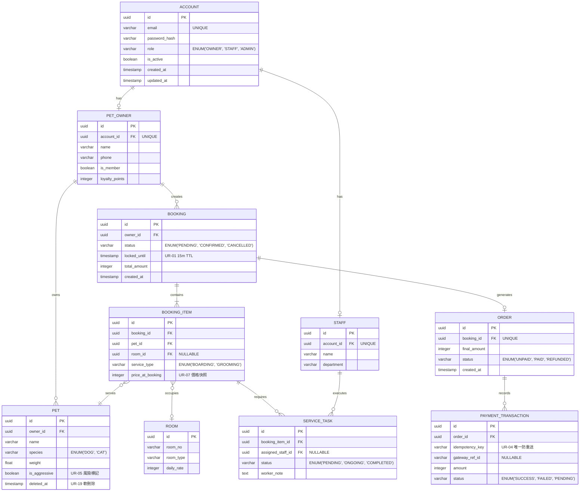

```mermaid
erDiagram
    %% ==========================================
    %% 1. 身分與權限模組 (Identity & Access)
    %% ==========================================
    ACCOUNT {
        uuid id PK
        varchar email "UNIQUE"
        varchar password_hash
        varchar role "ENUM('OWNER', 'STAFF', 'ADMIN')"
        boolean is_active
        timestamp created_at
        timestamp updated_at
    }

    PET_OWNER {
        uuid id PK
        uuid account_id FK "UNIQUE"
        varchar name
        varchar phone
        boolean is_member
        integer loyalty_points
    }

    STAFF {
        uuid id PK
        uuid account_id FK "UNIQUE"
        varchar name
        varchar department
    }

    %% ==========================================
    %% 2. 預約與寵物模組 (Booking & Pet)
    %% ==========================================
    PET {
        uuid id PK
        uuid owner_id FK
        varchar name
        varchar species "ENUM('DOG', 'CAT')"
        float weight
        boolean is_aggressive "UR-05 風險標記"
        timestamp deleted_at "UR-19 軟刪除"
    }

    ROOM {
        uuid id PK
        varchar room_no
        varchar room_type
        integer daily_rate
    }

    BOOKING {
        uuid id PK
        uuid owner_id FK
        varchar status "ENUM('PENDING', 'CONFIRMED', 'CANCELLED')"
        timestamp locked_until "UR-01 15m TTL"
        integer total_amount
        timestamp created_at
    }

    BOOKING_ITEM {
        uuid id PK
        uuid booking_id FK
        uuid pet_id FK
        uuid room_id FK "NULLABLE"
        varchar service_type "ENUM('BOARDING', 'GROOMING')"
        integer price_at_booking "UR-07 價格快照"
    }

    %% ==========================================
    %% 3. 營運與金流模組 (Payment & Ops)
    %% ==========================================
    ORDER {
        uuid id PK
        uuid booking_id FK "UNIQUE"
        integer final_amount
        varchar status "ENUM('UNPAID', 'PAID', 'REFUNDED')"
        timestamp created_at
    }

    PAYMENT_TRANSACTION {
        uuid id PK
        uuid order_id FK
        varchar idempotency_key "UR-04 唯一防重送"
        varchar gateway_ref_id "NULLABLE"
        integer amount
        varchar status "ENUM('SUCCESS', 'FAILED', 'PENDING')"
    }

    SERVICE_TASK {
        uuid id PK
        uuid booking_item_id FK
        uuid assigned_staff_id FK "NULLABLE"
        varchar status "ENUM('PENDING', 'ONGOING', 'COMPLETED')"
        text worker_note
    }

    %% ==========================================
    %% 關聯定義 (Relationships)
    %% ==========================================
    ACCOUNT ||--o| PET_OWNER : "has"
    ACCOUNT ||--o| STAFF : "has"
    
    PET_OWNER ||--o{ PET : "owns"
    PET_OWNER ||--o{ BOOKING : "creates"
    
    BOOKING ||--|{ BOOKING_ITEM : "contains"
    BOOKING ||--o| ORDER : "generates"
    
    BOOKING_ITEM }o--|| PET : "serves"
    BOOKING_ITEM }o--o| ROOM : "occupies"
    
    ORDER ||--o{ PAYMENT_TRANSACTION : "records"
    
    BOOKING_ITEM ||--o{ SERVICE_TASK : "requires"
    STAFF ||--o{ SERVICE_TASK : "executes"
```
